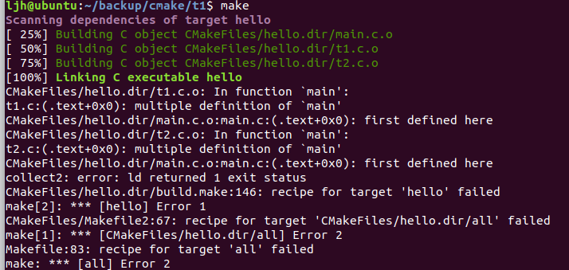
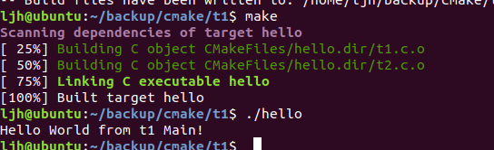
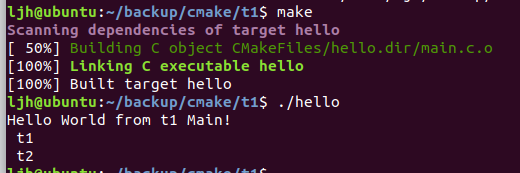

- 可以在Linux，Windows和mac中使用
- 生成库文件或者可执行文件
- 


### 一个最简单的cmakelists.txt的写法

```c++
PROJECT(HELLO) #可以在HELLO后面加工程的语言，如C,C++,Java
SET(SRC_LIST main.c) #set可以定义变量，用SRC_LIST代替main.c,此外，SRC_LIST可以代替多个文件，如SET(SRC_LIST mian.c t1.c,t2.c)
MESSAGE(STATUS "This is BINARY dir" ${HELLO_BINARY_DIR}) #此处为<projectName>_BINARY_DIR,指工程所在的路径，如main.c放在/backup/cmake/t1/下，则<projectName>_BINARY_DIR指的是该路径；但cmake内部有PROJECT_BINARY_DIR指定工程的路径，因此以后都使用PROJECT_BINARY_DIR，下面的SOURCE_DIR也是用PROJECT_SOURCE_DIR来代替，因为如果projectName改了之后，下面这些都要改，很麻烦，所以不使用
MESSAGE(STATUS "This is SOURCE dir" ${HELLO_SOURCE_DIR})
ADD_EXECUTABLE(hello ${SRC_LIST}) # SRC_LIST is main.c, is set by "SET"
```

- 对于上面的`SET(SRC_LIST mian.c t1.c,t2.c)`，如果将它们放入同一个`ADD_EXECUTABLE(hello ${SRC_LIST})`中，会报以下错误，因为它们有多个main函数



​		如果三个文件中，仅有一个包含main函数，则不会报错



如果三个文件是调用关系`SET(SRC_LIST main.c t1.h t2.h)`，且main.c包含mian函数，则可以正常执行



- 对于上面set定义的变量，引用时想要用**\${variable}**来使用

  ```
  SET(SRC_LIST mian.c )
  ADD_EXECUTABLE(hello ${SRC_LIST})
  ```

  

- make clean 可对构建结果进行清理

### 内部构建与外部构建

内部构建：cmake .  ，将生成中间文件，污染源工程的文件结构

外部构建：创建build文件，在build中生成所有的文件，对原工程文件结构没影响


### 更大的工程（外部构建）

- ADD_SUBDIRECTORY

`ADD_SUBDIRECTORY(source_dir [binary_dir] [EXCLUDE_FROM_ALL])` 

用于向当前工程添加存放源文件的子目录（如src），binary_dir是指中间二进制和目标二进制存 

放的位置（如：bin，该文件夹的位置为：build/bin；如果缺失，则二进制文件放在build/source_dir中,如上例中的src中）。EXCLUDE_FROM_ALL 参数的含义是将这个目录从编译过程中排除，比如，工程 

的 example，可能就需要工程构建完成后，再进入 example 目录单独进行构建

例子：

`ADD_SUBDIRECTORY(src bin)` ,在src中也有一个CMakeLists.txt

```
ADD_EXECUTABLE(hello main.c)
```

目录如下：

> src
>
> -------- main.c
>
> -------- CMakeLists.txt   #内容：ADD_EXECUTABLE(hello main.c)
>
> CMakeLists.txt    #内容：PROJECT(HELLO)   ADD_SUBDIRECTORY(src bin)
>
> build

由上可知，需要ADD_xxx的时候，要写在源代码所在的CMakeList.txt中，这个是executable，下面的add_library同理，而在工程根目录下的CMakeList.txt则写一些大的方面，如源文件（src），目标文件(bin)，链接库的目录等的位置


### 静态库与动态库的构建

目录结构：

> lib
>
> -------- hello.c
>
> -------- hello.h
>
> -------- CMakeLists.txt  #内容：SET(LIBHELLO_SRC hello.c)   ADD_LIBRARY(**hello** SHARED ${LIBHELLO_SRC})
>
> CMakeLists.txt    #内容：ADD_SUBDIRECTORY(lib)
>
> 

执行以上cmake后，会在build/lib中得到**lib**hello.so，即共享库，如果SHARED 改成STATIC，则为libhello.a即静态库


### 安装

`sudo make install` 可以将bin文件安装到/usr/bin/中，也可以自定义路径，如`make install DESTDIR=/tmp/test`，文件将安装在/tmp/test/usr/bin/目录中。


