[toc]


### 静态分析

- 静态分析是指用于自动查找源码中bug的算法和技术

- Clang Static Analyzer 的目的是为c/c++、oc提供一个企业级的静态分析框架，analyzer是clang的一部分

- 需要注意的点：

  - 速度比编译慢
  - 有假正例，需要人工找到并解决

- 静态分析不能找到所有的bug，找到的bug是已经熟知的特定bug，如果需要找到其他bug，可以提供自己的补丁或请求

- 跨平台使用LLVM会出现的问题：

  > 假如你正在Windows上写程序，又或者你正在和其他人合作，他们在Windows上编程，而你却在其他系统上，在这些情况下，你可能会遇到行尾 结束符问题。 这是因为Windows使用回车和换行两个字符来结束一行，而Mac和Linux只使用换行一个字符。 虽然这是小问题，但它会极大地扰乱跨平台协作。
  >
  > https://blog.csdn.net/xuewuzhijin2012/article/details/50117181
  >
  > git config --global core.autocrlf=false

### 为什么需要将源代码转化为AST

AST不依赖于具体的文法，不依赖于语言的细节，我们将源代码转化为AST后，可以对AST做很多的操作

> 抽象语法树（abstract syntax code，AST）是源代码的抽象语法结构的树状表示，树上的每个节点都表示源代码中的一种结构，之所以说是抽象的，是因为抽象语法树并不会表示出真实语法出现的每一个细节，比如说，嵌套括号被隐含在树的结构中，并没有以节点的形式呈现。

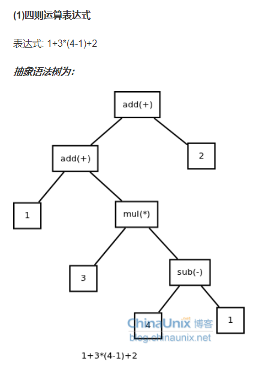

### JIT编译

just-in-time compilation

JIT 编译 (JIT compilation)，运行时需要代码时，将 Microsoft 中间语言 (MSIL) 转换为机器码的编译

- 做法：

  当载入一个类型时，CLR（common language runtime 公共语言运行库）为该类型创建一个内部数据结构和相应的函数,当函数第一被调用时,JIT将该函数编译成机器语言.当**再次遇到**该函数时则直接**从cache中执行已编译好的机器语言.**

- 相比解释型语言的好处
  - 已生成机器代码的语句可以从cache中找到并执行，解释型语言需要重新解释，对于循环来说JIT效率更好
  - 另一个是JIT会对代码进行优化，而解释型语言，执行到哪就解释到哪，无优化可言


### 为什么已经有了GCC还要开发Clang？Clang相比于GCC有什么优势？ 

 其实，这也是Clang当初在设计开发的时候所主要考虑的原因。Clang是一个高度模块化开发的轻量级编译器，它的编译速度快、占用内存小、非常方便进行二次开发。


### LLVM总览

- 包含llvm套装，包含了工具，库和头文件，也有汇编、反汇编、bitcode分析器和bitcode优化器
- 包含clang前端，可以将c/c++，oc/oc++转为llvm 代码
- 包含执行测试套装（execution test suite），在win中无法使用


# 实现一个编译器

### 1.程序读入

我们会先利用“[词法分析器](http://en.wikipedia.org/wiki/Lexical_analysis)”（也称为“扫描器”）将输入切成“语元（token）”，然后再做处理。词法分析器返回的每个语元都带有一个语元编号，此外可能还会附带一些元数据（比如某个数值）

- 使用全局变量，string存变量，double存常量（常数）

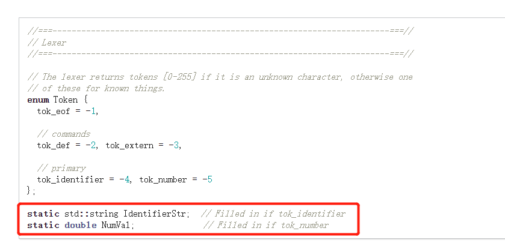

- 读取文本（代码）时，使用`isspace`来判断是否空格，直到读取的为非空格

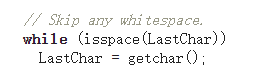

- Error(string) 用于报错，返回NULL


### 词法分析


- isalpha(char ) ：判断字符ch是否为英文字母，若为英文字母，返回非0（小写字母为2，大写字母为1）。若不是字母，返回0

- isalnum(char)：判断字符变量c是否为字母或数字，若是则返回非零，否则返回零。

  

#### top-down 分析：

- 用于分析二元运算符的表达式，如 a+b-c*d
- 想要定义符号优先级


## 代码生成

### SSA(static single assignment)

指在IR中，仅赋值一次且在使用前要定义好

- `TheModule` 是包含函数和全局变量的llvm构造器


### Clang 编译器

Clang 是 LLVM 的子项目，是 C、C++ 和 Objective-C 编译器，目标是替代传统编译器 GCC 。Clang 在整个 Objective-C 编译过程中扮演了编译器前端的角色，同时也参与到了 Swift 编译过程中的 Objective-C API 映射阶段。

Clang 的主要功能是输出代码对应的抽象语法树（ AST ），针对用户发生的编译错误准确地给出建议，并将代码编译成 LLVM IR。

Clang 的特点是编译速度快，模块化，代码简单易懂，诊断信息可读性强，占用内存小以及容易扩展和重用等。

我们以 Xcode 为例，Clang 编译 Objective-C 代码的速度是 Xcode 5 版本前使用的 GCC 的3倍，其生成的 AST 所耗用掉的内存仅仅是 GCC 的五分之一左右。

#### Clang 的主要工作：

- 预处理： 比如把宏嵌入到对应的位置,头文件的导入,去除注释（ clang -E main.m ）
- 词法分析： 这里会把代码切成一个个 Token，比如大小括号，等于号还有字符串等
- 语法分析： 验证语法是否正确
- 生成 AST ： 将所有节点组成抽象语法树 AST
- 静态分析：分析代码是否存在问题，给出错误信息和修复方案
- 生成 LLVM IR： `CodeGen` 会负责将语法树自顶向下遍历逐步翻译成 LLVM IR


### AST 最基本的节点

stmt（statement）和decl（declaration）


### 使用clang 对c++文件生成AST

test.cc:

```c++
int f(int x) {
  int result = (x / 42);
  return result;
}
```

生成AST的指令：`clang -Xclang -ast-dump -fsyntax-only test.cc`

主要内容：

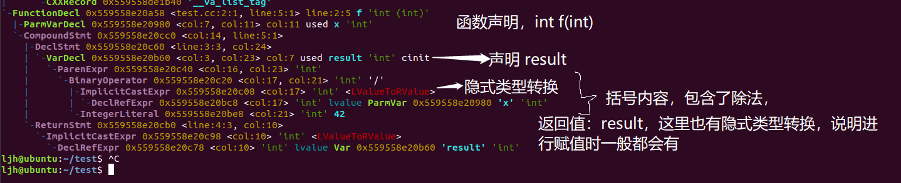


对于c++ ：`clang -Xclang -ast-dump -fsyntax-only t.cpp`

虽然输出了很多无用的信息，但生成的ast还是在最后显示，与c差别不大

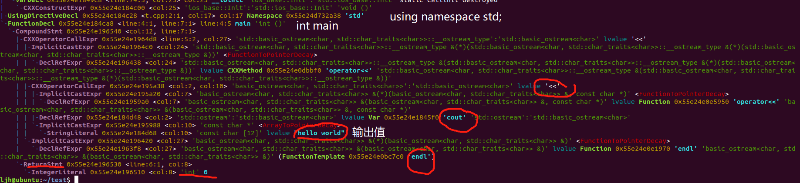

### clang 指令的记录

以t.c为例，代码为：

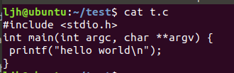

`clang --help`


- `clang file.c -fsyntax-only`  ：检查语法的正确性，若正确则无输出

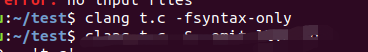

​	修改代码后，因为没有语法错误，所以这里报warning（因为这里是检查语法的，而不是语义，print未声明，但是不违背语法规则）：

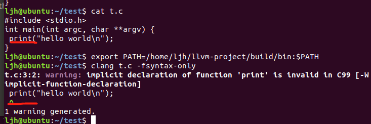

此处，修改代码，使其报error：

​	这里报error，因为是语法错误

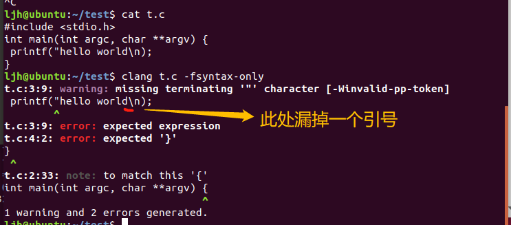


- `clang file.c -S -emit-llvm -o -` ：输出未优化的llvm代码

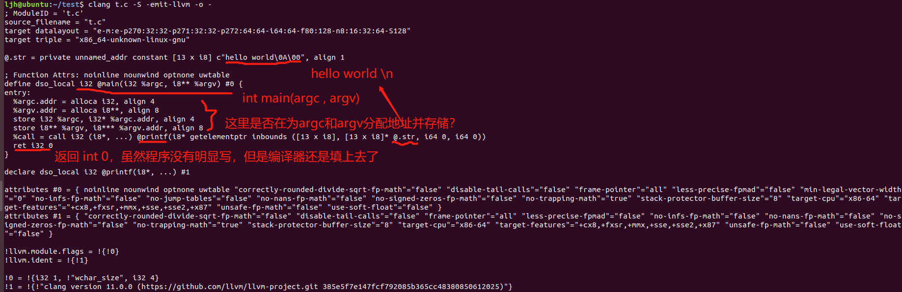


- `clang file.c -S -emit-llvm -o - -O3` ：对代码进行优化，注意:`-O3` O 为大写，3为优化级别，可以是1--3

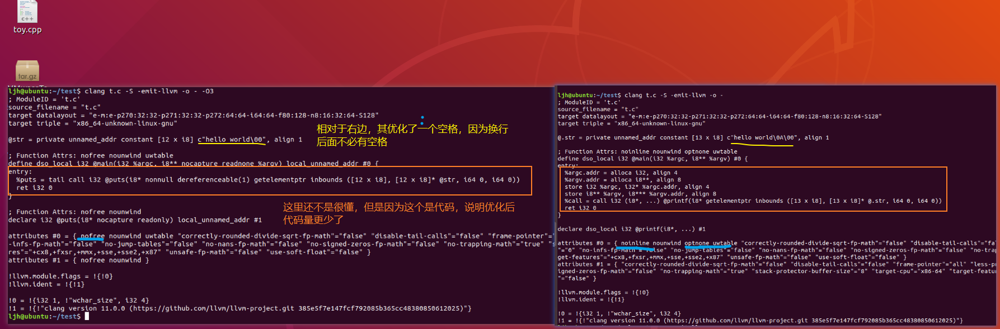

如果o为小写，则会生成文件名为`3`的未优化的llvm代码文件，当然，此时的3可以改为其他文件名


- `clang file.c -S -O3 -o -`  输出机器码

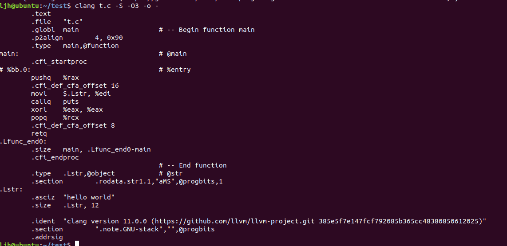


#### stderr和stdout

前者是两者都默认输出到屏幕中，但如果想要输入到磁盘文件中，则用stdout，如下：

fprintf(stderr, "Can't open it!\n");
fprintf(stdout, "Can't open it!\n");

假设执行  ./out >> a.txt

则 stderr输出到屏幕中，而stdout输出到a.txt中

执行 ./out，则两者都输出到屏幕中


### SRC_ROOT与OBJ_ROOT

SRC_ROOT：llvm的源码根目录

OBJ_ROOT: 项目和编译程序的顶层目录


### Linux环境变量

使用 `exprot PATH=\YOUR\OWN\PATH\bin:$PATH`时，改环境变量是暂时的，关闭该终端后会失效，而且要`$PATH`,否则系统的环境变量会消失


