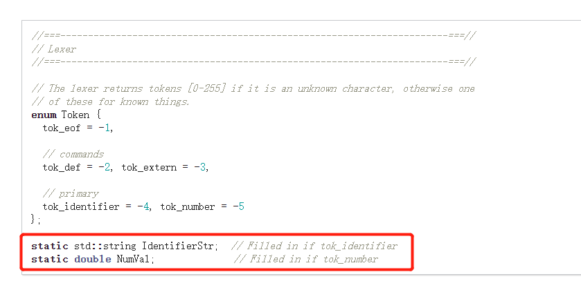
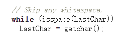

[toc]

### 静态分析

- 静态分析是指用于自动查找源码中bug的算法和技术

- Clang Static Analyzer 的目的是为c/c++、oc提供一个企业级的静态分析框架，analyzer是clang的一部分

- 需要注意的点：

  - 速度比编译慢
  - 有假正例，需要人工找到并解决

- 静态分析不能找到所有的bug，找到的bug是已经熟知的特定bug，如果需要找到其他bug，可以提供自己的补丁或请求

- 跨平台使用LLVM会出现的问题：

  > 假如你正在Windows上写程序，又或者你正在和其他人合作，他们在Windows上编程，而你却在其他系统上，在这些情况下，你可能会遇到行尾 结束符问题。 这是因为Windows使用回车和换行两个字符来结束一行，而Mac和Linux只使用换行一个字符。 虽然这是小问题，但它会极大地扰乱跨平台协作。
  >
  > https://blog.csdn.net/xuewuzhijin2012/article/details/50117181
  >
  > git config --global core.autocrlf false

### 为什么需要将源代码转化为AST

AST不依赖于具体的文法，不依赖于语言的细节，我们将源代码转化为AST后，可以对AST做很多的操作

> 抽象语法树（abstract syntax code，AST）是源代码的抽象语法结构的树状表示，树上的每个节点都表示源代码中的一种结构，之所以说是抽象的，是因为抽象语法树并不会表示出真实语法出现的每一个细节，比如说，嵌套括号被隐含在树的结构中，并没有以节点的形式呈现。

### JIT编译

just-in-time compilation

JIT 编译 (JIT compilation)，运行时需要代码时，将 Microsoft 中间语言 (MSIL) 转换为机器码的编译

- 做法：

  当载入一个类型时，CLR（common language runtime 公共语言运行库）为该类型创建一个内部数据结构和相应的函数,当函数第一被调用时,JIT将该函数编译成机器语言.当**再次遇到**该函数时则直接**从cache中执行已编译好的机器语言.**

- 相比解释型语言的好处
  - 已生成机器代码的语句可以从cache中找到并执行，二解释型语言需要重新解释，对于循环来说JIT效率更好
  - 另一个是JIT会对代码进行优化，而解释型语言，执行到哪就解释到哪，无优化可言

### 为什么已经有了GCC还要开发Clang？Clang相比于GCC有什么优势？ 

 其实，这也是Clang当初在设计开发的时候所主要考虑的原因。Clang是一个高度模块化开发的轻量级编译器，它的编译速度快、占用内存小、非常方便进行二次开发。

### LLVM总览

- 包含llvm套装，包含了工具，库和头文件，也有汇编、反汇编、bitcode分析器和bitcode优化器
- 包含clang前端，可以将c/c++，oc/oc++转为llvm 代码
- 包含执行测试套装（execution test suite），在win中无法使用

# 实现一个编译器

### 1.程序读入

我们会先利用“[词法分析器](http://en.wikipedia.org/wiki/Lexical_analysis)”（也称为“扫描器”）将输入切成“语元（token）”，然后再做处理。词法分析器返回的每个语元都带有一个语元编号，此外可能还会附带一些元数据（比如某个数值）

- 使用全局变量，string存变量，double存常量（常数）

- 读取文本（代码）时，使用`isspace`来判断是否空格，直到读取的为非空格

### 词法分析

不后悔，现在家里正渐渐好起来，

如果继续读研，那么家里的期盼会更大，

要等待、期待的事情就更多，时间不等人

而且，继续读的话，要背更多的债，读出来可能工资不高，还债困难

不是什么研究生都吃香的

