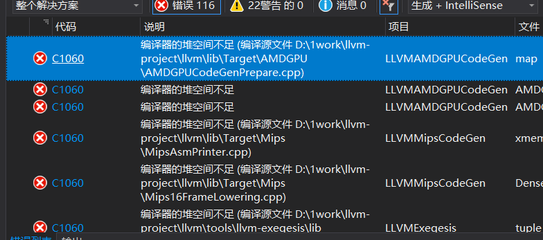

**编译器的堆空间不足**：


```
严重性	代码	说明	项目	文件	行	禁止显示状态
错误	C1060	编译器的堆空间不足 (编译源文件 D:\1work\llvm-project\llvm\lib\Target\AMDGPU\AMDGPUCodeGenPrepare.cpp)	LLVMAMDGPUCodeGen	D:\visual stdio\VC\Tools\MSVC\14.16.27023\include\map	128	

```



### llvm 编译时遇到的问题

https://blog.csdn.net/jimmyleeee/article/details/79400829